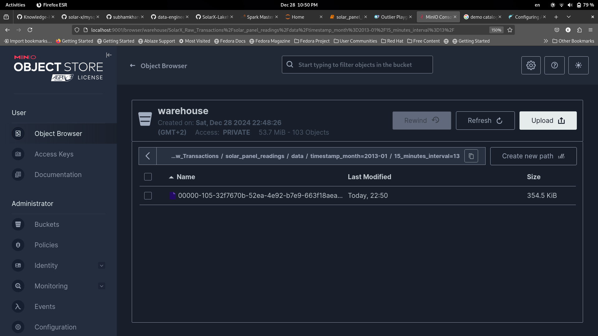
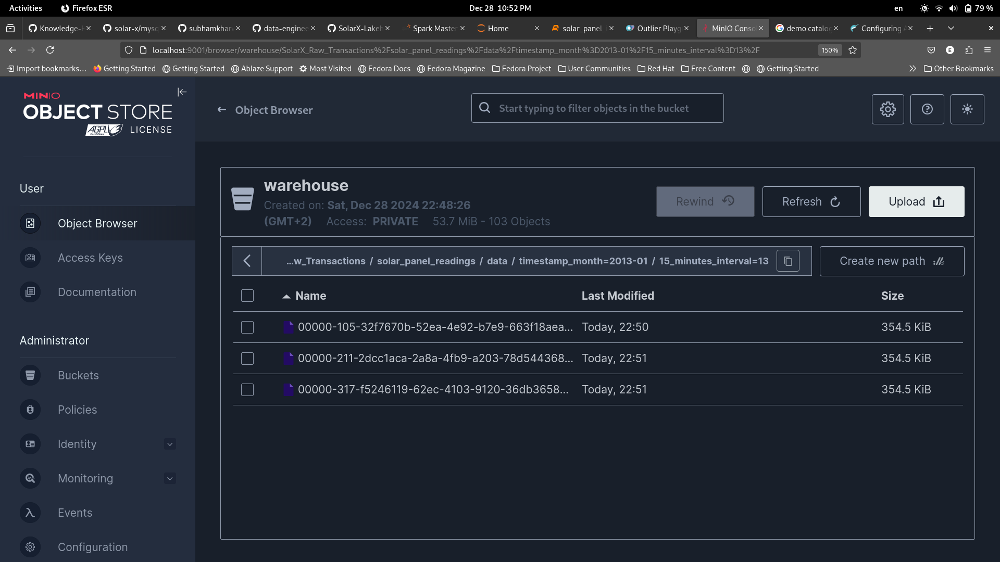
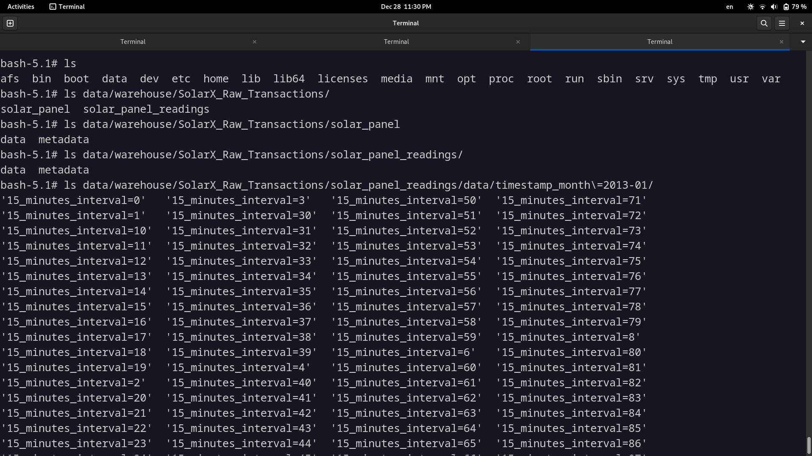

# SolarX-Lakehouse
Designing a Lakehouse for extensive data frequency of SoalrX with Spark and Iceberg as big data tools.

**In progress**

<br/>

# Some background on the data

We start by splitting the `EGY_QH_Helwan` data collected back in 2013, the data is sampled each one hour and is nicely formatted in a csv file after running the `split_weather_data.py` script which makes a csv file for each day in the `weather_history_splitted` directory

```bash
python3 split_weather_data.py
```


<br/>

A sample of the `2013-01-01.csv` data


The average size of this data is 23 KB with about 1400 rows, but to truly leverage spark capabilities I resampled this data down to go from frequency by hour to 5 ms, which increased the same day csv file size to around 730 MB with around 16,536001 rows.

The resampling happens with the `resample_weather_data.py` script which takes the above csv file an argument, resample it and write it down to `lakehouse/weather_history_splitted_resampled` directory.

```bash
python3 resample_weather_data.py weather_history_splitted/2013-01-01.csv
```


<br/>

A sample of the resampled `2013-01-01.csv` data


<br/>
<br/>

# Cluster configuration setup
In the docker compose file, there are 4 workers and one master, `spark-worker-1` to `spark-worker-4`. We can specify the default memory and cores in the environment variables below.

<br/>

The setup is 4 workers each with 1G of memory and 2 cores, and example of the worker service is below.
```docker
spark-worker-1:
	image: tabulario/spark-iceberg
	container_name: spark-worker-1
	build: spark/

	volumes:
		- ./spark_workers.sh:/opt/spark/spark_workers.sh
	
	networks:
		- iceberg_net
	
	environment:
		- AWS_ACCESS_KEY_ID=admin		
		- AWS_SECRET_ACCESS_KEY=password
		- AWS_REGION=us-east-1
		- SPARK_MODE=worker
		- SPARK_MASTER_URL=spark://spark-master:7077
		- SPARK_WORKER_CORES=2
		- SPARK_WORKER_MEMORY=1G
	
	depends_on:
		- spark-master
```

<br/>

### To start the cluster:
**An important note**: **make sure your machine have these extra resources for the workers, if not then remove some of the workers or allocate fewer cpu and memory for them**

First we run the docker compose file which will start the spark master, workers and iceberg 
```bash
docker compose up
```

```bash
docker ps

spark-worker-4
	Container ID: 1e04615dcfca
	Command: "./entrypoint.sh not…"
	Image: tabulario/spark-iceberg
	CreatedAt: 2024-12-26 18:34:31 +0200 EET
	Status: Up 12 minutes
	Ports: 
	
spark-worker-1
	Container ID: 89ffe36c4c4d
	Command: "./entrypoint.sh not…"
	Image: tabulario/spark-iceberg
	CreatedAt: 2024-12-26 18:34:31 +0200 EET
	Status: Up 12 minutes
	Ports: 
	
spark-worker-2
	Container ID: 0c7fdc403ff0
	Command: "./entrypoint.sh not…"
	Image: tabulario/spark-iceberg
	CreatedAt: 2024-12-26 18:34:31 +0200 EET
	Status: Up 12 minutes
	Ports: 
	
spark-worker-3
	Container ID: 70fedbe3d4f7
	Command: "./entrypoint.sh not…"
	Image: tabulario/spark-iceberg
	CreatedAt: 2024-12-26 18:34:31 +0200 EET
	Status: Up 12 minutes
	Ports: 
	
mc
	Container ID: 6dcc184f047c
	Command: "/bin/sh -c ' until …"
	Image: minio/mc
	CreatedAt: 2024-12-26 18:34:31 +0200 EET
	Status: Up 12 minutes
	Ports: 
	
spark-master
	Container ID: 9252dc083912
	Command: "./entrypoint.sh not…"
	Image: tabulario/spark-iceberg
	CreatedAt: 2024-12-26 18:34:31 +0200 EET
	Status: Up 12 minutes
	Ports: 0.0.0.0:8080->8080/tcp, :::8080->8080/tcp, 0.0.0.0:8888->8888/tcp, :::8888->8888/tcp, 0.0.0.0:10000-10001->10000-10001/tcp, :::10000-10001->10000-10001/tcp
	
minio
	Container ID: 9c066befff9e
	Command: "/usr/bin/docker-ent…"
	Image: minio/minio
	CreatedAt: 2024-12-26 18:34:31 +0200 EET
	Status: Up 12 minutes
	Ports: 0.0.0.0:9000-9001->9000-9001/tcp, :::9000-9001->9000-9001/tcp
	
iceberg-rest
	Container ID: 143c5c0a1703
	Command: "java -jar iceberg-r…"
	Image: apache/iceberg-rest-fixture
	CreatedAt: 2024-12-26 18:34:31 +0200 EET
	Status: Up 12 minutes (healthy)
	Ports: 0.0.0.0:8181->8181/tcp, :::8181->8181/tcp
```

<br/>

There is one other step we need to do, connect the workers with the master, we do that using the `spark_workers.sh` bash script.
```bash
docker exec -it spark-worker-1 /bin/bash -c "chmod +x /opt/spark/spark_workers.sh && /opt/spark/spark_workers.sh"
```

```bash
docker exec -it spark-worker-2 /bin/bash -c "chmod +x /opt/spark/spark_workers.sh && /opt/spark/spark_workers.sh"
```

```bash
docker exec -it spark-worker-3 /bin/bash -c "chmod +x /opt/spark/spark_workers.sh && /opt/spark/spark_workers.sh"
```

```bash
docker exec -it spark-worker-4 /bin/bash -c "chmod +x /opt/spark/spark_workers.sh && /opt/spark/spark_workers.sh"
```

Navigate to the url `127.0.0.1:8080` in which the spark master is running, make a note of the spark master internal url `spark://9611ff031a11:7077`, we will need it in the session creation step below.

We can see that all worker is now recognized by the master.

<br/>

Note that we could've just run the script as a command in docker compose file, but some reason it doesn't work.

<br/>
<br/>

# Driving solar panel readings data with spark
Here we start working on the 730 MB and 16,536001 records of data of first day, we start by setting up the cluster, the choice was 3 workers with 6 executors each with 1 core and 512M for memory.

```python
spark = (
    SparkSession
    .builder
    .appName("Solar Power")
    .master("spark://9611ff031a11:7077")
    .config("spark.executor.cores", 1)
    .config("spark.cores.max", 6)
    .config("spark.executor.memory", "512M")
    .getOrCreate()
)
```

<br/>

After creating the spark session, here with app name `Solar Power`, you can navigate to this session related app jobs and stages details on `127.0.0.1:4041` to better understand how the job is working and optimize it.

Then we load the csv file and partition with a derived column `hour`, this partitioning will ensure data spreading without skewing and will help down the line in processing, also it will prevent memory spill.

```python
_schema = "timestamp timestamp, solar_intensity float, temp float"

weather_df = spark.read.format("csv").schema(_schema).option("header", True)\
                   .load("/home/iceberg/warehouse/weather_history_splitted_resampled/2013-01-01.csv")\
                   .withColumn("hour", F.hour(F.col("timestamp")))
```

Then we do the calculations to drive the solar panel power for each reading, we assume an approximate linear model in the calculations, a good enough approximation hence it's not really the point here, then we save the data as csv, we will use parquet format down the line.

<br/>

Here is the explain plan, only one necessary exchange (shuffling) at the begging. 


And here are the files saved partitioned by hour of the day with some sizes of them, it's on the order of 20M to 40M each.


<br/>

## Optimization in this step

As you can see there is a spill both in memory and disk, which is very expensive, the job took about 25 seconds, to solve this problem we have a number of options:

- Increase the number of executors and their memory (we can't here I've limited resources in my laptop)
- increase the number of partitions

I went with option 2, I increased the number of partitions from 23 to 92, 92 being the number of every 15 minutes time interval of the day.
```python
_schema = "timestamp timestamp, solar_intensity float, temp float"

weather_df = spark.read.format("csv").schema(_schema).option("header", True)\
                   .load("/home/iceberg/warehouse/weather_history_splitted_resampled/2013-01-01.csv")\
                   .withColumn("15_min_interval", F.floor((F.hour(F.col("timestamp"))*60 + F.minute(F.col("timestamp")) - 60) / 15))
```

```python
spark.conf.set("spark.sql.shuffle.partitions", 92)
weather_partitioned_df = weather_df.repartition(92, F.col('15_min_interval'))
```

```python
solar_panel_readings_df.write.format("csv").option("header", True).mode("overwrite").partitionBy("15_min_interval") \
                       .save("/home/iceberg/warehouse/weather_history_splitted_resampled/solar_panel_readings/2013-01-01.csv")
```


And now there is no spill in memory and disk, as a result the job went from taking 25 seconds to just 14 seconds, and the size per partition is also decreased down to from 5M to 10M.


Now to have a structured lakehouse with tables format and to have some management and governance on the data, we will need a tool to help orchestrate and facilitate that, if continue saving the data like we did above it will quickly become a mess without versioning and also it will be a hustle to update data (overwriting). 

So going forward will use `iceberg` for that, iceberg also have a nice api that we can use to query the data saved on disk in csv or parquet format as if it was a table with normal sql, so it will feel homey for the analytical team.


<br/>
<br/>

# Lakehouse Raw Records 
### solar_panel and solar_panel_readings tables

We start with those two tables `solar_panel` and `solar_panel_readings`,
```sql 
%%sql

CREATE TABLE SolarX_Raw_Transactions.solar_panel(
    id INT,
    name VARCHAR(25) NOT NULL,
    capacity_kwh FLOAT NOT NULL,
    intensity_power_rating FLOAT NOT NULL,
    temperature_power_rating FLOAT NOT NULL
)
USING iceberg
```

```sql
%%sql

CREATE TABLE SolarX_Raw_Transactions.solar_panel_readings(
    timestamp TIMESTAMP NOT NULL,
    15_minutes_interval INT NOT NULL,
    panel_id INT NOT NULL,
    generated_power_amount FLOAT NOT NULL
)
USING iceberg
PARTITIONED BY (MONTH(timestamp), 15_minutes_interval);
```

We are partitioning the raw readings on both the `month` and the `15_minutes_interval`, and the power is calculated same as before, the only difference is that now we have 3 solar panels and instead of saving the data into `csvs`, we are saving them with `iceberg`, and iceberg under the hod saves them in `parquet` format. 

<br/>

We can see here on `127.0.0.1:9000` using the `minio` service in the docker compose, log in with username and password specified in the docker compose file, after creating the two tables in the jupyter notebook.

Inside each directory exists two dirs, `data` and `metadata`, the data files will be organized using the partitioning we provided, fore example here after inserting the first solar panel data
```python
panel_id = 1
solar_panel_readings_df1 = calc_solar_readings(panel_id, weather_partitioned_df)
solar_panel_readings_df1.createOrReplaceTempView("temp_view_1")
```

```sql
%%sql
    
INSERT INTO SolarX_Raw_Transactions.solar_panel_readings (timestamp, 15_minutes_interval, panel_id, generated_power_amount)
SELECT timestamp                  as timestamp,
       15_min_interval            as 15_minutes_interval,
       1                          as panel_id,
       current_generation_watt    as generated_power_amount
       
FROM temp_view_1
```



And after inserting the other two solar panels data, another two files get created.


Same structure will apply if we were using a cloud storage based service like amazon S3 for example, also these data can also be inspected form the container `minio`
