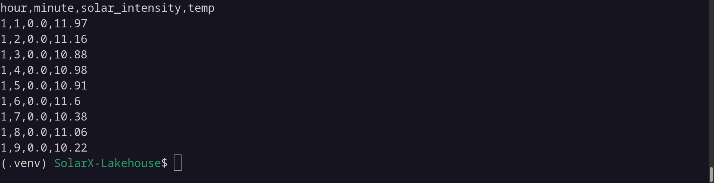

# SolarX-Lakehouse

# Some background on the data

We start by splitting the `EGY_QH_Helwan` data collected back in 2013, the data is sampled each one hour and is nicely formatted in a csv file after running the `split_weather_data.py` script which makes a csv file for each day in the `weather_history_splitted` directory

```bash
python3 split_weather_data.py
```


<br/>

A sample of the `2013-01-01.csv` data


The average size of this data is 23 KB with about 1400 rows, but to truly leverage spark capabilities I resampled this data down to go from frequency by hour to 5 ms, which increased the same day csv file size to around 730 MB with around 16,536001 rows.

The resampling happens with the `resample_weather_data.py` script which takes the above csv file an argument, resample it and write it down to `weather_history_splitted_resampled` folder.

```bash
python3 resample_weather_data.py weather_history_splitted/2013-01-01.csv
```


<br/>

A sample of the resampled `2013-01-01.csv` data


<br/>
<br/>

# Cluster configuration setup
In the docker compose file, there are 4 workers and one master, `spark-worker-1` to `spark-worker-4`. We can specify the default memory and cores in the environment variables below.

<br/>

The setup is 4 workers each with 1G of memory and 2 cores.
```docker

spark-worker-1:
	image: tabulario/spark-iceberg
	container_name: spark-worker-1
	build: spark/

	volumes:
		- ./spark_workers.sh:/opt/spark/spark_workers.sh
	
	networks:
		- iceberg_net
	
	environment:
		- AWS_ACCESS_KEY_ID=admin		
		- AWS_SECRET_ACCESS_KEY=password
		- AWS_REGION=us-east-1
		- SPARK_MODE=worker
		- SPARK_MASTER_URL=spark://spark-master:7077
		- SPARK_WORKER_CORES=2
		- SPARK_WORKER_MEMORY=1G
	
	depends_on:
		- spark-master
```

<br/>

### To start the cluster:
First we run the docker compose file which will start the spark master, workers and iceberg 
```bash
docker compose up
```

```bash
docker ps

spark-worker-4
	Container ID: 1e04615dcfca
	Command: "./entrypoint.sh not…"
	Image: tabulario/spark-iceberg
	CreatedAt: 2024-12-26 18:34:31 +0200 EET
	Status: Up 12 minutes
	Ports: 
	
spark-worker-1
	Container ID: 89ffe36c4c4d
	Command: "./entrypoint.sh not…"
	Image: tabulario/spark-iceberg
	CreatedAt: 2024-12-26 18:34:31 +0200 EET
	Status: Up 12 minutes
	Ports: 
	
spark-worker-2
	Container ID: 0c7fdc403ff0
	Command: "./entrypoint.sh not…"
	Image: tabulario/spark-iceberg
	CreatedAt: 2024-12-26 18:34:31 +0200 EET
	Status: Up 12 minutes
	Ports: 
	
spark-worker-3
	Container ID: 70fedbe3d4f7
	Command: "./entrypoint.sh not…"
	Image: tabulario/spark-iceberg
	CreatedAt: 2024-12-26 18:34:31 +0200 EET
	Status: Up 12 minutes
	Ports: 
	
mc
	Container ID: 6dcc184f047c
	Command: "/bin/sh -c ' until …"
	Image: minio/mc
	CreatedAt: 2024-12-26 18:34:31 +0200 EET
	Status: Up 12 minutes
	Ports: 
	
spark-master
	Container ID: 9252dc083912
	Command: "./entrypoint.sh not…"
	Image: tabulario/spark-iceberg
	CreatedAt: 2024-12-26 18:34:31 +0200 EET
	Status: Up 12 minutes
	Ports: 0.0.0.0:8080->8080/tcp, :::8080->8080/tcp, 0.0.0.0:8888->8888/tcp, :::8888->8888/tcp, 0.0.0.0:10000-10001->10000-10001/tcp, :::10000-10001->10000-10001/tcp
	
minio
	Container ID: 9c066befff9e
	Command: "/usr/bin/docker-ent…"
	Image: minio/minio
	CreatedAt: 2024-12-26 18:34:31 +0200 EET
	Status: Up 12 minutes
	Ports: 0.0.0.0:9000-9001->9000-9001/tcp, :::9000-9001->9000-9001/tcp
	
iceberg-rest
	Container ID: 143c5c0a1703
	Command: "java -jar iceberg-r…"
	Image: apache/iceberg-rest-fixture
	CreatedAt: 2024-12-26 18:34:31 +0200 EET
	Status: Up 12 minutes (healthy)
	Ports: 0.0.0.0:8181->8181/tcp, :::8181->8181/tcp
```

<br/>

There is one other step we need to do, connect the workers with the master, we do that using the `spark_workers.sh` bash script.
```bash
docker exec -it spark-worker-1 /bin/bash -c "chmod +x /opt/spark/spark_workers.sh && /opt/spark/spark_workers.sh"
```

```bash
docker exec -it spark-worker-2 /bin/bash -c "chmod +x /opt/spark/spark_workers.sh && /opt/spark/spark_workers.sh"
```

```bash
docker exec -it spark-worker-3 /bin/bash -c "chmod +x /opt/spark/spark_workers.sh && /opt/spark/spark_workers.sh"
```

```bash
docker exec -it spark-worker-4 /bin/bash -c "chmod +x /opt/spark/spark_workers.sh && /opt/spark/spark_workers.sh"
```


We can see that all worker is now recognized by the master.

<br/>

Note that we could've just run the script as a command in docker compose file, but some reason it doesn't work.