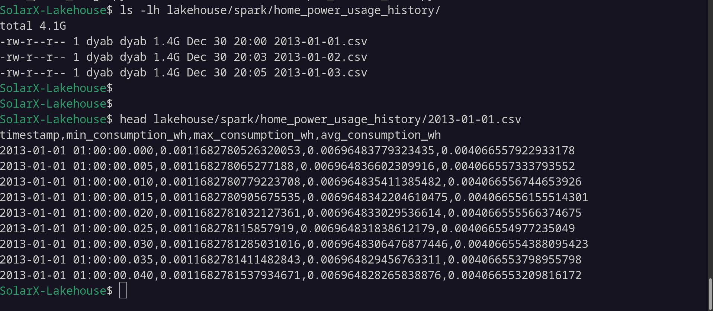
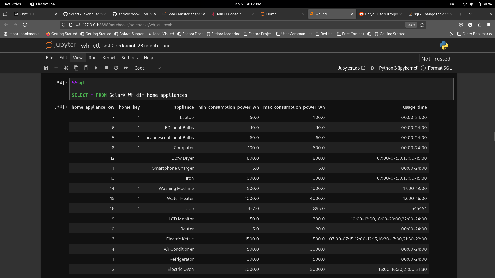
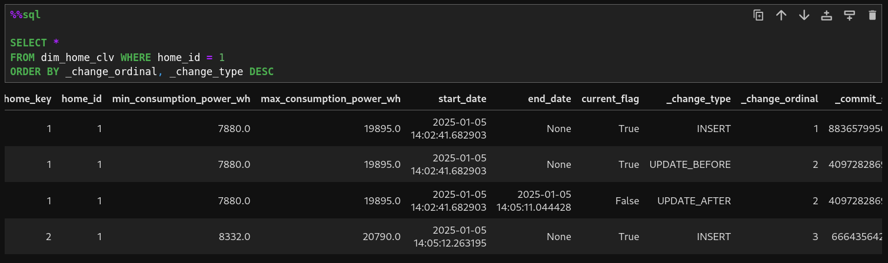
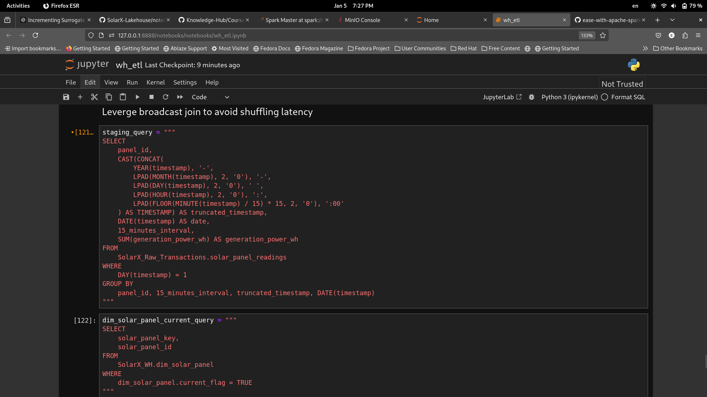
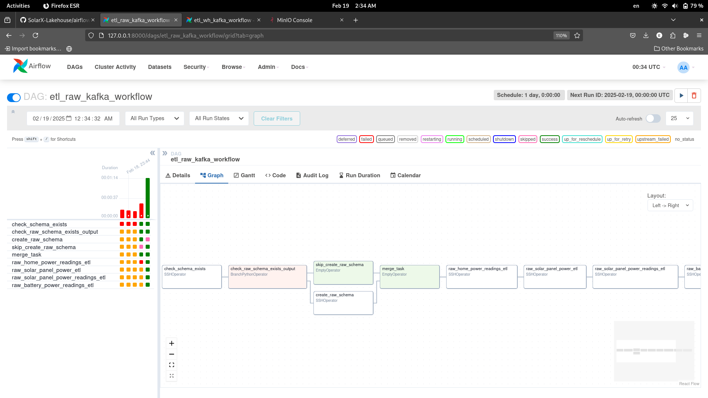

# Table of Contents
- [Introduction](#introduction)
	- [**Data Source & Ingestion**](#data-source-ingestion)
	- [**Key Features**](#key-features)
    - [**Tech Stack**](#tech-stack)
- [Some Background on the Data Sources (Derived)](#some-background-on-the-data-sources-derived)
	- [Weather Data](#weather-data)
	- [Home Data](#home-data)
- [Some Background on the Data Sources (Kafka Logs)](#some-background-on-the-data-sources-kafka-logs)
- [Cluster Configuration Setup](#cluster-configuration-setup)
	- [Docker Setup](#docker-setup)
		- [To Start the Cluster:](#to-start-the-cluster)
	- [Kubernetes Setup](#kubernetes-setup)
		- [Using host installed docker images](#using-host-installed-docker-images)
		- [A lock into `configMaps` and `secrets`](#a-lock-into-configmaps-and-secrets)
- [Derive Solar Panel Readings with Spark](#derive-solar-panel-readings-with-spark)
	- [Optimization in this step](#optimization-in-this-step)
- [Lakehouse Raw Records ](#lakehouse-raw-records)
	- [Solar Tables](#solar-tables)
	- [Home Power Usage Tables](#home-power-usage-tables)
	- [Battery Tables](#battery-tables)
- [Warehouse](#warehouse)
	- [Model](#model)
		- [Home Appliances Dimension](#home-appliances-dimension)
		- [Home Dimension](#home-dimension)
		- [Home Fact](#home-fact)
		- [Solar Panel Dimension](#solar-panel-dimension)
		- [Solar Panel Fact](#solar-panel-fact)
		- [Battery Dimension](#battery-dimension)
		- [Battery Fact](#battery-fact)
		- [Date Dimension](#date-dimension)
	- [SolarX_WH namespace/database tables](#solarx_wh-namespacedatabase-tables)
	- [Warehouse ETL](#warehouse-etl)
		- [Home Appliances Dimension](#home-appliances-dimension-1)
		- [Home  Dimension](#home-dimension-1)
		- [Home Power Readings Fact](#home-power-readings-fact)
		- [Solar Panel Dimension](#solar-panel-dimension-1)
		- [Solar Panel Power Reading Fact](#solar-panel-power-reading-fact)
		- [Battery Dimension](#battery-dimension-1)
		- [Battery Reading Fact](#battery-reading-fact)
- [Submitting ETL Python Scripts to Spark Cluster](#submitting-etl-python-scripts-to-spark-cluster)
	- [With Docker](#with-docker)
		 - [For Raw Data](#for-raw-data)
			- [For home](#for-home)
			- [For solar panel ](#for-solar-panel)
			- [For battery ](#for-battery)
		- [For Warehouse Data](#for-warehouse-data)
			- [For home](#for-home-1)
			- [For solar panel](#for-solar-panel-1)
			- [For battery ](#for-battery-1)
		- [Submitting ETL Python Scripts to Spark Cluster With Airflow](#submitting-etl-python-scripts-to-spark-cluster-with-airflow)
	- [With Kubernetes ](#with-kubernetes)


# Introduction
**SolarX Lakehouse** is a **big data platform** designed to handle and analyze energy consumption, solar energy production, and battery energy storage. The project follows a **modern lakehouse architecture**, integrating **Apache Spark, Iceberg, Kafka, Docker, and Kubernetes to enable scalable, real-time monitoring and batch processing.

### **Data Source & Ingestion**

The data powering **SolarX Lakehouse** comes from the **Solar-X Kafka logged data** repository ([Solar-X](https://github.com/eslamdyab21/solar-x)), where real-time energy data is streamed from IoT devices monitoring **solar panels, battery storage, and household energy consumption**. **Apache Kafka** acts as the data pipeline, streaming structured JSON logs into the **Lakehouse storage**.

### **Key Features**
1. **Streaming & Batch Data Processing:**
    - **Apache Kafka** enables real-time monitoring from **[Solar-X](https://github.com/eslamdyab21/solar-x)** IoT devices.
    - **Spark Structured Streaming** processes live data efficiently.
    - Supports **batch ETL processing** for historical analysis.
2. **Scalable Storage & Data Modeling:**
    - Uses **Apache Iceberg** to store raw and transformed data.
    - Implements **a structured Data Warehouse layer** for optimized analytics.
    - Supports **time-travel queries**, schema evolution, and transactional consistency.
3. **Big Data Computation with Apache Spark:**
    - Enables large-scale distributed data processing.
    - Performs **advanced analytics and aggregations** on energy data.
4. **Lakehouse Architecture for Analytics:**
    - Combines the benefits of **data lakes** (scalability, raw storage) and **data warehouses** (structured querying, ACID transactions).
    - **Multi-layered storage model:**
        - **Raw Kafka logs** → Stored as-is for historical reference.
        - **Processed wh structured data** → Cleaned and Optimized for analytics & BI tools.
5. **Containerization & Orchestration (Docker + Kubernetes):**
	- **Docker and Kubernetes** containerizes all components (Spark, Kafka, Iceberg) for easy deployment and orchestrating scalable workloads.
6. **Workflow Orchestration (Apache Airflow)**
	- **Data Ingestion:** Airflow manages the orchestration of data ingestion from Apache Kafka in batches, coordinating the flow of streaming data into the lakehouse storage.
	- **ETL Processes:** It schedules and manages ETL tasks, leveraging Apache Spark for data transformation and ensuring that processed data is accurately stored in Apache Iceberg tables.


### **Tech Stack**
- Processing: **Apache Spark**
- Storage: **Minio** object storage and **Apache Iceberg**
- Streaming: **Apache Kafka**
- Workflow Orchestration: **Apache Airflow**
- Containerization & Orchestration: Docker and Kubernetes
- Query Engine: **SQL**-based querying on Iceberg tables
- Data Warehouse Modeling: **Dimensional & Facts** schema for structured analytics

This system (SolarX-Monitoring-App and SolarX-Lakehouse) provides a **fully scalable and reliable solution** for managing solar energy data, supporting real-time monitoring, analytics, and predictive insights for optimized energy usage.


<br/>

# Some Background on the Data Sources (Derived)
In this part we derive the home power usage and solar panels power generation without using the data generated by SolarX Kafka Logs, ofx we will use kafka logged data later on. 
## Weather Data

We start by splitting the `EGY_QH_Helwan` data collected back in 2013, the data is sampled each one hour and is nicely formatted in a csv file after running the `split_weather_data.py` script which makes a csv file for each day in the `weather_history_splitted` directory

```bash
python3 split_weather_data.py
```


<br/>

A sample of the `2013-01-01.csv` data


The average size of this data is 23 KB with about 1400 rows, but to truly leverage spark capabilities I resampled this data down to go from frequency by hour to 5 ms, which increased the same day csv file size to around `730 MB` with around `16,536001 rows`.

The resampling happens with the `resample_weather_data.py` script which takes the above csv file an argument, resample it and write it down to `lakehouse/spark/weather_history_splitted_resampled` directory.

```bash
python3 resample_weather_data.py weather_history_splitted/2013-01-01.csv
```


<br/>

A sample of the resampled `2013-01-01.csv` data


<br/>
<br/>

## Home Data

We could've grabed some home power usage data from the internet, but to make it more customized and variable, the home power usage is calculated based on the data provided in a `json` file `home_appliances_consumption.json`, in it we add the different devices we have in our home and their corresponding hourly power rating and the time of use.

```json
{
	"Refrigerator":	
		{
		"consumption": [300,1500],
		"time": "00:00-24:00"
		},
	"Electric Oven":
		{
		"consumption": [2000,5000],
		"time": "16:00-16:30,21:00-21:30"
		},
	"Electric Kettle":
		{
		"consumption": [1500,1500],
		"time": "07:00-07:15,12:00-12:15,16:30-17:00,21:30-22:00"
		},
	"Air Conditioner":
		{
		"consumption": [500,3000],
		"time": "00:00-24:00"
		},
}
```

Above is a sample of to get an idea, `consumption` have a minimum and maximum value a device can draw, and in `time` we specify ranges each separated with a `,`.

<br/>

The data is also resampled to `5ms` like the weather data for the same reason and it's size this time is around `1.4GB`

The process happens using the `home_power_usage.py` script which takes the same above weather csv file an argument and write the home usage down to `lakehouse/spark/home_power_usage_history` directory, the weather csv file purpose is just to extract the corresponding date.

```bash
python3 home_power_usage.py weather_history_splitted/2013-01-03.csv
```

A sample of the resampled `2013-01-01.csv` data and files sizes



<br/>
<br/>
<br/>

# Some Background on the Data Sources (Kafka Logs)

A real time data is being streamed with kafka each one second, weather data, home power usage data, solar panel data and batteries data. We will batch each day worth of data and use it as the source data.

Inside kafka container run the following, it will save the data from kafka topics into log files that we can later use.
```bash
kafka-console-consumer.sh --bootstrap-server localhost:9092 --topic battery_data --from-beginning >> kafka_log_battery_data_$(date +%Y-%m-%d).log &

kafka-console-consumer.sh --bootstrap-server localhost:9092 --topic home_energy_consumption --from-beginning >> kafka_log_home_energy_consumption_$(date +%Y-%m-%d).log &

kafka-console-consumer.sh --bootstrap-server localhost:9092 --topic solar_energy_data --from-beginning >> kafka_log_solar_energy_data_$(date +%Y-%m-%d).log &
```

Then in your host so that the data is available to spark.
```bash
docker cp kafka:/kafka_log_battery_data_2025-02-13.log ~/Documents/projects/SolarX-Lakehouse/lakehouse/spark/solarx_kafka_log_data/

docker cp kafka:/kafka_log_home_energy_consumption_2025-02-13.log ~/Documents/projects/SolarX-Lakehouse/lakehouse/spark/solarx_kafka_log_data/

docker cp kafka:/kafka_log_solar_energy_data_2025-02-13.log ~/Documents/projects/SolarX-Lakehouse/lakehouse/spark/solarx_kafka_log_data/
```

An example of battery log data:
```log
{"time_stamp": "2025-02-14 02:08:59", "batteries": {"battery_1": {"capacity_kwh": 12, "max_charge_speed_w": 1, "current_energy_wh": 9860, "is_charging": 0, "status": "ideal", "max_output_w": 3.33}, "battery_2": {"capacity_kwh": 12, "max_charge_speed_w": 1, "current_energy_wh": 8600, "is_charging": 0, "status": "ideal", "max_output_w": 3.33}, "battery_3": {"capacity_kwh": 12, "max_charge_speed_w": 1, "current_energy_wh": 9993.67, "is_charging": 0, "status": "discharging", "max_output_w": 3.33}}

{"time_stamp": "2025-02-14 02:09:00", "batteries": {"battery_1": {"capacity_kwh": 12, "max_charge_speed_w": 1, "current_energy_wh": 9860, "is_charging": 0, "status": "ideal", "max_output_w": 3.33}, "battery_2": {"capacity_kwh": 12, "max_charge_speed_w": 1, "current_energy_wh": 8600, "is_charging": 0, "status": "ideal", "max_output_w": 3.33}, "battery_3": {"capacity_kwh": 12, "max_charge_speed_w": 1, "current_energy_wh": 9992.87, "is_charging": 0, "status": "discharging", "max_output_w": 3.33}}

{"time_stamp": "2025-02-14 02:09:01", "batteries": {"battery_1": {"capacity_kwh": 12, "max_charge_speed_w": 1, "current_energy_wh": 9860, "is_charging": 0, "status": "ideal", "max_output_w": 3.33}, "battery_2": {"capacity_kwh": 12, "max_charge_speed_w": 1, "current_energy_wh": 8600, "is_charging": 0, "status": "ideal", "max_output_w": 3.33}, "battery_3": {"capacity_kwh": 12, "max_charge_speed_w": 1, "current_energy_wh": 9992.13, "is_charging": 0, "status": "discharging", "max_output_w": 3.33}}
```


<br/>
<br/>
<br/>

# Cluster Configuration Setup
## Docker Setup
In the docker compose file, there are 4 workers and one master, `spark-worker-1` to `spark-worker-4`. We can specify the default memory and cores in the environment variables below.

<br/>

The setup is 4 workers each with 1G of memory and 2 cores, and example of the worker service is below.
```docker
spark-worker-1:
	image: tabulario/spark-iceberg
	container_name: spark-worker-1
	build: spark/

	volumes:
		- ./spark_workers.sh:/opt/spark/spark_workers.sh
	
	networks:
		- iceberg_net
	
	environment:
		- AWS_ACCESS_KEY_ID=admin		
		- AWS_SECRET_ACCESS_KEY=password
		- AWS_REGION=us-east-1
		- SPARK_MODE=worker
		- SPARK_MASTER_URL=spark://spark-master:7077
		- SPARK_WORKER_CORES=2
		- SPARK_WORKER_MEMORY=1G
	
	depends_on:
		- spark-master
```

<br/>

### To Start the Cluster:
**An important note**: **make sure your machine have these extra resources for the workers, if not then remove some of the workers or allocate fewer cpu and memory for them**

First we run the docker compose file which will start the spark master, workers and iceberg 
```bash
docker compose up
```

<br/>

There is one other step we need to do, connect the workers with the master, we do that using the `spark_workers.sh` bash script.
```bash
docker exec -it spark-worker-service-name /bin/bash -c "chmod +x /opt/spark/spark_workers.sh && /opt/spark/spark_workers.sh"
```


Navigate to the url `127.0.0.1:8080` in which the spark master is running, make a note of the spark master internal url `spark://9611ff031a11:7077`, we will need it in the session creation step below.

We can see that all worker is now recognized by the master.

<br/>

Note that we could've just run the script as a command in docker compose file, but some reason it doesn't work.

<br/>
<br/>


## Kubernetes Setup
If setting up the environment locally, make sure you have `minikube` installed, then specify how much resources you will give it and  `SolarX-Lakehouse-TEMP` directory will have 
```bash
SolarX-Lakehouse-TEMP$ ls
lakehouse  notebooks  spark_etls  spark_workers.sh
```
or you can just copy them with `minikube cp` or `scp`

```bash
minikube start --vm-driver=kvm2 --cpus=6 --memory=8192 --mount --mount-string=/home/dyab/Documents/projects/SolarX-Lakehouse-TEMP:/tmp/solarx/
```

<br/>

### Using host installed docker images
If we care about using already downloaded docker images in host machine
- With small size images
```bash
minikube image load minio/mc
minikube image load minio/minio
minikube image load apache/iceberg-rest-fixture
```
- With big size images
```bash
docker save -o spark-iceberg.tar tabulario/spark-iceberg
minikube cp ./spark-iceberg.tar /tmp/solarx/spark-iceberg.tar
```

```bash
minikube ssh
docker load -i /tmp/solarx/spark-iceberg.tar
```

Then we create a namespace `lakehouse` for our cluster 
```bash
kubectl create namespace lakehouse
kubectl config set-context --current --namespace=lakehouse
kubectl apply -f k8s-configMaps.yaml
kubectl apply -f k8s-secrets.yaml
kubectl apply -f k8s.yaml
```

```bash
SolarX-Lakehouse$ kubectl get pods
NAME                                       READY   STATUS    RESTARTS   AGE
mc-deployment-59d667df79-9kpqs             1/1     Running   0          24s
minio-deployment-754449f485-k65n8          1/1     Running   0          24s
rest-deployment-6b4f5566fb-jtt5b           1/1     Running   0          24s
spark-master-deployment-6fcd6d868d-4777s   1/1     Running   0          24s
spark-worker-deployment-54cf5f9898-jq285   1/1     Running   0          24s
spark-worker-deployment-54cf5f9898-p752q   1/1     Running   0          24s
```

### A lock into `configMaps` and `secrets`
```python
apiVersion: v1
kind: ConfigMap
metadata:
	name: spark-config
data:
	AWS_ACCESS_KEY_ID: admin
	AWS_REGION: us-east-1
	SPARK_MODE_MASTER: master
	SPARK_MODE_WORKER: worker
	SPARK_MASTER_URL: spark://spark-master-service:7077
	SPARK_WORKER_CORES: '2'
	SPARK_WORKER_MEMORY: 1G
	CATALOG_WAREHOUSE: s3://warehouse/
	CATALOG_IO__IMPL: org.apache.iceberg.aws.s3.S3FileIO
	CATALOG_S3_ENDPOINT: http://minio:9000
	CATALOG_S3_PATH__STYLE__ACCESS: 'true'
	MINIO_ROOT_USER: admin
	MINIO_DOMAIN: minio
	REST_API_URL: http://rest:8181
	MINIO_ENDPOINT: http://minio:9000
```

```python
apiVersion: v1
kind: Secret
metadata:
	name: spark-secret
type: Opaque
data:
	AWS_SECRET_ACCESS_KEY: cGFzc3dvcmQ=
	MINIO_ROOT_PASSWORD: cGFzc3dvcmQ=
```
Where `AWS_SECRET_ACCESS_KEY` and `MINIO_ROOT_PASSWORD` are encoded as `password`, of course in a production setting the `secrets` should not be pushed whatsoever.

- We can specify the number of replicas for `spark-worker-deployment` in the `k8s.yaml`, it's set to be 2 by default.

- Connect workers to master, make sure to change `spark-master` to `spark-master-service` in the `spark_workers.sh` bash script for this setup with k8s.
```bash
kubectl exec -it <pod-name> -- /bin/bash -c "chmod +x /opt/spark/spark_workers.sh && /opt/spark/spark_workers.sh"
```

<br/>
<br/>

# Derive Solar Panel Readings with Spark
Here we start working on the 730 MB and 16,536001 records of data of first day, we start by setting up the cluster, the choice was 3 workers with 6 executors each with 1 core and 512M for memory.

```python
spark = (
    SparkSession
    .builder
    .appName("Solar Power")
    .master("spark://9611ff031a11:7077")
    .config("spark.executor.cores", 1)
    .config("spark.cores.max", 6)
    .config("spark.executor.memory", "512M")
    .getOrCreate()
)
```

<br/>

After creating the spark session, here with app name `Solar Power`, you can navigate to this session related app jobs and stages details on `127.0.0.1:4041` to better understand how the job is working and optimize it.

Then we load the csv file and partition with a derived column `hour`, this partitioning will ensure data spreading without skewing and will help down the line in processing, also it will prevent memory spill.

```python
_schema = "timestamp timestamp, solar_intensity float, temp float"

weather_df = spark.read.format("csv").schema(_schema).option("header", True)\
                   .load("/home/iceberg/warehouse/weather_history_splitted_resampled/2013-01-01.csv")\
                   .withColumn("hour", F.hour(F.col("timestamp")))
```

Then we do the calculations to drive the solar panel power for each reading, we assume an approximate linear model in the calculations, a good enough approximation since it's not really the point here, then we save the data as csv, we will use parquet format down the line.

<br/>

Here is the explain plan, only one necessary exchange (shuffling) at the begging. 


And here are the files saved partitioned by hour of the day with some sizes of them, it's on the order of `20M` to `40M` each.


<br/>

## Optimization in this step

As you can see there is a spill both in memory and disk, which is very expensive, the job took about `25` seconds, to solve this problem we have a number of options:

- Increase the number of executors and their memory (we can't here I've limited resources in my laptop)
- increase the number of partitions

I went with option 2, I increased the number of partitions from 23 to 92, 92 being the number of every 15 minutes time interval of the day.
```python
_schema = "timestamp timestamp, solar_intensity float, temp float"

weather_df = spark.read.format("csv").schema(_schema).option("header", True)\
                   .load("/home/iceberg/warehouse/weather_history_splitted_resampled/2013-01-01.csv")\
                   .withColumn("15_min_interval", F.floor((F.hour(F.col("timestamp"))*60 + F.minute(F.col("timestamp")) - 60) / 15))
```

```python
spark.conf.set("spark.sql.shuffle.partitions", 92)
weather_partitioned_df = weather_df.repartition(92, F.col('15_min_interval'))
```

```python
solar_panel_readings_df.write.format("csv").option("header", True).mode("overwrite").partitionBy("15_min_interval") \
                       .save("/home/iceberg/warehouse/weather_history_splitted_resampled/solar_panel_readings/2013-01-01.csv")
```


And now there is no spill in memory and disk, as a result the job went from taking `25` seconds to just `14` seconds, and the size per partition is also decreased down to the range from `5MB` to `10MB`.


Now to have a structured lakehouse with tables format and to have some management and governance on the data, we will need a tool to help orchestrate and facilitate that, if continue saving the data like we did above it will quickly become a mess without versioning and also it will be a hustle to update data (overwriting). 

So going forward will use `iceberg` for that, iceberg also have a nice api that we can use to query the data saved on disk in csv or parquet format as if it was a table with normal sql, so it will feel homey for the analytical team.


<br/>
<br/>

# Lakehouse Raw Records 
##  Solar Tables

You can find the code in the `notebooks/raw_solar_panel_iceberg_tables.ipynb` which will be a `.py` file later with the others to run the pipeline with `Airflow`.

We start with those two tables solar_panel and solar_panel_readings
```sql 
%%sql

CREATE TABLE SolarX_Raw_Transactions.solar_panel(
    id INT,
    name VARCHAR(25) NOT NULL,
    capacity_kwh FLOAT NOT NULL,
    intensity_power_rating FLOAT NOT NULL,
    temperature_power_rating FLOAT NOT NULL
)
USING iceberg
```

```sql
%%sql

CREATE TABLE SolarX_Raw_Transactions.solar_panel_readings(
    timestamp TIMESTAMP NOT NULL,
    15_minutes_interval INT NOT NULL,
    panel_id INT NOT NULL,
    generation_power_wh FLOAT NOT NULL
)
USING iceberg
PARTITIONED BY (DAY(timestamp), panel_id, 15_minutes_interval);
```

We are partitioning the raw readings on the `day`, `solar panel id` and the `15_minutes_interval`, the power is calculated same as before, the only difference is that now we have 3 solar panels and instead of saving the data into `csvs`, we are saving them with `iceberg`, and iceberg under the hod saves them in `parquet` format. 

<br/>

We are partitioning the raw readings on both the `day`, that would be a lot of partitions you might say in the long run, we would only keep the last 7 days of raw data in our lakehouse, because after this one week period we generally won't be interested in the high frequency data and also to minimize space cost.

Instead we will save the past data in the `15_minutes_interval` frequency in another table in the warehouse, and this table is what will be used in the analytics.

<br/>

We can see here on `127.0.0.1:9000` using the `minio` service in the docker compose, log in with username and password specified in the docker compose file, after creating the two tables in the jupyter notebook, All raw data will live inside `Raw Transactions` and later we will make a new dir/table for the warehouse low frequency aggregated data for analytics.


Inside each directory exists two dirs, `data` and `metadata`, the data files will be organized using the partitioning we provided, fore example here after inserting the first solar panel data
```python
panel_id = 1
solar_panel_readings_df1 = calc_solar_readings(panel_id, weather_partitioned_df)
solar_panel_readings_df1.createOrReplaceTempView("temp_view_1")
```

```sql
%%sql
    
INSERT INTO SolarX_Raw_Transactions.solar_panel_readings (timestamp, 15_minutes_interval, panel_id, generation_power_wh)
SELECT timestamp                  as timestamp,
       15_min_interval            as 15_minutes_interval,
       1                          as panel_id,
       current_generation_watt    as generation_power_wh
       
FROM temp_view_1
```

And after inserting the other two solar panels data


Same structure will apply if we were using a cloud storage based service like amazon S3 for example, also these data can also be inspected form the container `minio`


<br/>

Also and interesting observation, the csv files of one solar panel data of one day was around `600MB` in size, now the 3 solar panels data combined is only around `171.6MB` in size, this nice reduction in size comes from the fact that iceberg saves the data in `parquet` format and this format uses `run length encoding` which can reduce the size of the data if the low cardinality data are grouped together, and that is the case in our data, the average sun hours is something like `11` hours a day, and the rest is just `zero`, so the solar power generated is zero in the rest, and we're partitioning in way that also groups those zeros together to achieve this reduction in size.


<br/>
<br/>

##  Home Power Usage Tables
You can find the code in the `notebooks/raw_home_power_load_iceberg_tables.ipynb` which will be a `.py` file later with the others to run the pipeline with `Airflow`.

Only one table is used here which has the power usage related data
```sql
%%sql

CREATE TABLE SolarX_Raw_Transactions.home_power_readings(
    timestamp               TIMESTAMP NOT NULL,
    15_minutes_interval     SMALLINT  NOT NULL,
    min_consumption_wh      FLOAT     NOT NULL,
    max_consumption_wh      FLOAT     NOT NULL
)
USING iceberg
PARTITIONED BY (DAY(timestamp), 15_minutes_interval);
```

We are partitioning the raw readings on both the `day` and the `15_minutes_interval`, that would be a lot of partitions you might say in the long run, we would only keep the last 7 days of raw data in our lakehouse, because after this one week period we generally won't be interested in the high frequency data and also to minimize space cost.

Instead we will save the past data in the 15_minutes_interval frequency in another table in the warehouse, and this table is what will be used in the analytics.


Also the 3 days worth of data size combined is only `350MB` compared to one day of data in the source making `1.4GB`.

<br/>

Some quick analysis
```sql
%%sql

SELECT 
    DAY(timestamp) as day, 
    SUM(min_consumption_wh)/1000 as min_consumption_kwh, 
    SUM(max_consumption_wh)/1000 as max_consumption_kwh
FROM SolarX_Raw_Transactions.home_power_readings
GROUP BY day

|day|min_consumption_kwh|max_consumption_kwh|
|-|------------------|------------------|
|1|31.030535656945837|126.82835777154983|
|2|33.01199622871832 |121.20579759246623|
|3|31.291361060320924|121.99561212848174|
```


<br/>
<br/>

## Battery Tables
You can find the code for battery and also the above two (solar and home) from solarx kafka logged data in the `notebooks/raw_kafka_log_data_iceberg.ipynb` which will be a `.py` file later with the others to run the pipeline with `Airflow`.

solar and home raw schema for kafka logged data is the same as above, we only add here the raw battery_readings table. 
```sql 
%%sql

CREATE TABLE SolarX_Raw_Transactions.battery_readings(
    timestamp               TIMESTAMP NOT NULL,
    15_minutes_interval     INT NOT NULL,
    battery_name            VARCHAR(15) NOT NULL,
    capacity_kwh            FLOAT NOT NULL,
    max_charge_speed_w      FLOAT NOT NULL,
    current_energy_wh       FLOAT NOT NULL,
    is_charging             FLOAT NOT NULL,
    status                  VARCHAR(15) NOT NULL,
    max_output_w            FLOAT NOT NULL
)
USING iceberg
PARTITIONED BY (DAY(timestamp), battery_name, 15_minutes_interval);
```


<br/>
<br/>
<br/>

# Warehouse
In this part we will aggregate the raw data into a low frequency data which are suitable for long term storage and would be easier to analyse and is more governed. 

We start by creating a new name-space/database in iceberg catalog for the warehouse tables, separate from the previous `SolarX_Raw_Transactions` of the raw data.
```sql
%%sql

CREATE DATABASE IF NOT EXISTS SolarX_WH
```

<br/>

## Model
You can find the code in the `notebooks/wh_facts_dimensions_iceberg_tables.ipynb` which will be a `.py` file later with the others to run the pipeline with `Airflow`.

<br/>

### Home Appliances Dimension
```sql
%%sql

CREATE TABLE SolarX_WH.dim_home_appliances(
    home_appliance_key                  SMALLINT    NOT NULL,
    home_key                            SMALLINT    NOT NULL, -- REFERENCES dim_home(home_key)
    appliance                           VARCHAR(25) NOT NULL,    
    min_consumption_power_wh            FLOAT       NOT NULL,
    max_consumption_power_wh            FLOAT       NOT NULL,
    usage_time                          VARCHAR(50) NOT NULL
)
USING iceberg;
```

<br/>

### Home Dimension
```sql
%%sql

CREATE TABLE SolarX_WH.dim_home(
    home_key                             SMALLINT    NOT NULL,
    home_id                              SMALLINT    NOT NULL,
    min_consumption_power_wh             FLOAT       NOT NULL,
    max_consumption_power_wh             FLOAT       NOT NULL,

    -- scd type2 for min_consumption_power_wh
    start_date                           TIMESTAMP   NOT NULL,
    end_date                             TIMESTAMP,

    current_flag                         BOOLEAN NOT NULL
)
USING iceberg;
```
We model the `consumption_power` as a slowly changing dimensions of type 2 to be able to historically track the home load changes.

<br/>

### Home Fact
```sql
%%sql

CREATE TABLE SolarX_WH.fact_home_power_readings(
    home_power_reading_key          TIMESTAMP     NOT NULL,
    home_key                        SMALLINT      NOT NULL,   -- REFERENCES dim_home(home_key)
    date_key                        TIMESTAMP     NOT NULL,   -- REFERENCES dim_date(date_key)

    min_consumption_power_wh        FLOAT         NOT NULL,
    max_consumption_power_wh        FLOAT         NOT NULL 
)

USING iceberg
PARTITIONED BY (MONTH(date_key))
```

It's worth noting here that the `home_power_reading_key` will be a combination of the `date` and the `15_minutes_interval` from the source raw data to uniquely identify the readings.


<br/>

### Solar Panel Dimension
```sql
%%sql

CREATE TABLE SolarX_WH.dim_solar_panel(
    solar_panel_key                             INT         NOT NULL,
    solar_panel_id                              SMALLINT    NOT NULL,
    name                                        VARCHAR(20) NOT NULL,    
    capacity_kwh                                FLOAT       NOT NULL,
    intensity_power_rating_wh                   FLOAT       NOT NULL,
    temperature_power_rating_c                  FLOAT       NOT NULL,

    -- scd type2
    start_date                                  TIMESTAMP   NOT NULL,
    end_date                                    TIMESTAMP,

    current_flag                                BOOLEAN
)
USING iceberg;
```
We model the `capacity_kwh`, `intensity_power_rating_wh` and `temperature_power_rating_c` as slowly changing dimensions of type 2 to be able to historically track the solar panels changes.

<br/>

### Solar Panel Fact
```sql
%%sql

CREATE TABLE SolarX_WH.fact_solar_panel_power_readings(
    solar_panel_key                 SMALLINT      NOT NULL,   -- REFERENCES dim_solar_panel(solar_panel_key)
    date_key                        TIMESTAMP     NOT NULL,   -- REFERENCES dim_date(date_key)
    
    solar_panel_id                  INT           NOT NULL,
    generation_power_wh             FLOAT         NOT NULL 
)

USING iceberg
PARTITIONED BY (MONTH(date_key), solar_panel_id)
```


<br/>

### Battery Dimension
```sql
%%sql

CREATE TABLE SolarX_WH.dim_battery(
    battery_key                             INT         NOT NULL,
    battery_id                              SMALLINT    NOT NULL,
    name                                    VARCHAR(15) NOT NULL,    
    capacity_kwh                            FLOAT       NOT NULL,
    max_charge_speed_w                      FLOAT       NOT NULL,
    max_output_w                            FLOAT       NOT NULL,

    -- scd type2
    start_date                              TIMESTAMP   NOT NULL,
    end_date                                TIMESTAMP,

    current_flag                            BOOLEAN
)
USING iceberg;
```
We model the `capacity_kwh`, `max_charge_speed_w` and `max_output_w` as slowly changing dimensions of type 2 to be able to historically track the solar panels changes.

<br/>

### Battery Fact
```sql
%%sql

CREATE TABLE SolarX_WH.fact_battery_power_readings(
    battery_key                     SMALLINT      NOT NULL,   -- REFERENCES dim_batteryl(solar_panel_key)
    date_key                        TIMESTAMP     NOT NULL,   -- REFERENCES dim_date(date_key)
    
    battery_id                      SMALLINT      NOT NULL,
    current_energy_wh               FLOAT         NOT NULL,
    is_charging                     SMALLINT      NOT NULL,
    status                          VARCHAR(15)   NOT NULL 
)

USING iceberg
PARTITIONED BY (MONTH(date_key), battery_id)
```


<br/>

### Date Dimension
```sql
%%sql

CREATE TABLE SolarX_WH.dim_date
(
    date_key            TIMESTAMP  NOT NULL,
    year                SMALLINT   NOT NULL,
    quarter             SMALLINT   NOT NULL,
    month               SMALLINT   NOT NULL,
    week                SMALLINT   NOT NULL,
    day                 SMALLINT   NOT NULL,
    hour                SMALLINT   NOT NULL,
    minute              SMALLINT   NOT NULL,
    is_weekend          BOOLEAN    NOT NULL
)

USING iceberg
PARTITIONED BY (month, minute)
```


<br/>

## SolarX_WH namespace/database tables


<br/>
<br/>
<br/>

## Warehouse ETL
In this section we extract transform and load the lakehouse raw data into the warehouse lower granularity dimensions and tables.

<br/>

### Home Appliances Dimension
We use the `home_appliances_consumption.json` file as the source data here and load it into the `dim_home_appliances`, first we process the json data with pandas, make a temporary view of the dataframe then invoke the following 
```sql
%%sql

MERGE INTO SolarX_WH.dim_home_appliances dim_app
USING 
    (SELECT    home_appliance_key        as home_appliance_key, 
               home_key                  as home_key,
               name                      as appliance,
               min_consumption_rating    as min_consumption_power_wh,
               max_consumption_rating    as max_consumption_power_wh,
               usage_time                as usage_time
    FROM temp_view_2) tmp
    
ON dim_app.home_appliance_key = tmp.home_appliance_key

WHEN MATCHED AND (
    dim_app.min_consumption_power_wh != tmp.min_consumption_power_wh OR
    dim_app.max_consumption_power_wh != tmp.max_consumption_power_wh
) THEN UPDATE SET 
    dim_app.min_consumption_power_wh = tmp.min_consumption_power_wh,
    dim_app.max_consumption_power_wh = tmp.max_consumption_power_wh

WHEN NOT MATCHED THEN INSERT *
```
Which make only insert new data and update the existing if matching, we didn't use `scd2` here, we will use it with the home dimension.

A snapshot of the table content



<br/>

### Home  Dimension
We use the `dim_home_appliances` as the source data here and load it into the `dim_home` after calculation the the total power per hour for the home usage, the etl is splited into two main sequential process. 
```sql
%%sql

MERGE INTO SolarX_WH.dim_home dim_home
USING (
    SELECT 
        home_key, 
        SUM(min_consumption_power_wh) AS min_consumption_power_wh,
        SUM(max_consumption_power_wh) AS max_consumption_power_wh 
    FROM SolarX_WH.dim_home_appliances
    GROUP BY home_key
) dim_app
ON dim_home.home_id = dim_app.home_key AND dim_home.current_flag = TRUE

WHEN MATCHED AND (
    dim_home.max_consumption_power_wh != dim_app.max_consumption_power_wh OR
    dim_home.min_consumption_power_wh != dim_app.min_consumption_power_wh
) THEN UPDATE SET 
    dim_home.end_date = NOW(),
    dim_home.current_flag = FALSE;
```

```sql
%%sql

MERGE INTO SolarX_WH.dim_home dim_home
USING (
    SELECT 
        home_key, 
        SUM(min_consumption_power_wh) AS min_consumption_power_wh,
        SUM(max_consumption_power_wh) AS max_consumption_power_wh 
    FROM SolarX_WH.dim_home_appliances
    GROUP BY home_key
) dim_app
ON dim_home.home_id = dim_app.home_key AND dim_home.current_flag = TRUE

WHEN NOT MATCHED THEN 
INSERT (
    home_key,
    home_id,
    min_consumption_power_wh, 
    max_consumption_power_wh,
    start_date,
    end_date,
    current_flag
) VALUES (
    (SELECT COUNT(*) FROM SolarX_WH.dim_home) + 1,
    1,
    dim_app.min_consumption_power_wh,
    dim_app.max_consumption_power_wh,
    NOW(),
    NULL,
    TRUE
);
```

And here is a test run for the `scd2` when changing the source data `dim_home_appliances`- two times in the background and running the `etl` again.


<br/>

Also `iceberg` natively tracks the changes creating a snapshot with each `INSERT, UPDATE, DELETE` operation we do, so it kinda do the `scd` internally.

```sql
%%sql

CALL demo.system.create_changelog_view(
    table => 'SolarX_WH.dim_home',
    changelog_view => 'dim_home_clv',
    identifier_columns => array('home_id')
)
```



And we can go back and time travel to any snapshot even if delete the record.

<br/>


### Home Power Readings Fact
We use the high rate raw `SolarX_Raw_Transactions.home_power_readings` as the source data here and load it into the `fact_home_power_readings` after extracting the relevant data from the source, like decrease the granularity from ms to batches of 15 minutes and extracting the the date and keys.

We also take the `dim_home` from earlier as a source too for the `home_key`.

<br/>

The ETL process consists of two main parts, First extract the desired data from the raw source with the below query
```sql
%%sql

SELECT
     TIMESTAMP(FLOOR(UNIX_MICROS(timestamp) / (15 * 60 * 1000000)) * (15 * 60)) AS home_power_reading_key,
    DATE(timestamp) AS date,
    15_minutes_interval,
    SUM(min_consumption_wh) AS min_consumption_power_wh,
    SUM(max_consumption_wh) AS max_consumption_power_wh
FROM 
    SolarX_Raw_Transactions.home_power_readings
WHERE 
    DAY(timestamp) = 1
GROUP BY 
    15_minutes_interval, home_power_reading_key, DATE(timestamp)
ORDER BY 
    home_power_reading_key
LIMIT 10
```
A look of how this looks like

We used the timestamp of 15 minutes chunks as a surrogate key, it's also not strait forward to get the normal incremental key in a parallel computing setup like here, and the timestamp is guaranteed to be unique.

Then we use the previous query as window function with merge operation to only insert new data
```sql
%%sql

WITH staging_table AS (
    SELECT
         CAST(CONCAT(
            YEAR(timestamp), '-', 
            LPAD(MONTH(timestamp), 2, '0'), '-', 
            LPAD(DAY(timestamp), 2, '0'), ' ',
            LPAD(HOUR(timestamp), 2, '0'), ':',
            LPAD(FLOOR(MINUTE(timestamp) / 15) * 15, 2, '0'), ':00'
        ) AS TIMESTAMP) AS home_power_reading_key,
        DATE(timestamp) AS date,
        15_minutes_interval,
        SUM(min_consumption_wh) AS min_consumption_power_wh,
        SUM(max_consumption_wh) AS max_consumption_power_wh
    FROM 
        SolarX_Raw_Transactions.home_power_readings
    WHERE 
        DAY(timestamp) = 1
    GROUP BY 
        15_minutes_interval, home_power_reading_key, DATE(timestamp)
)


    
MERGE INTO SolarX_WH.fact_home_power_readings AS target
USING staging_table AS source
ON target.home_power_reading_key = source.home_power_reading_key
      
WHEN NOT MATCHED THEN
    INSERT (home_power_reading_key, 
            home_key, 
            date_key, 
            min_consumption_power_wh,
            max_consumption_power_wh
    
    ) 
    VALUES (source.home_power_reading_key,
            (SELECT home_key FROM SolarX_WH.dim_home WHERE dim_home.current_flag = TRUE), 
            source.home_power_reading_key,
            source.min_consumption_power_wh,
            source.max_consumption_power_wh     
    );
```


And here is the final outcome of this fact table


<br/>

The above inserted `day 1`  data, now we try inserting `day 2` by only changing `DAY(timestamp) = 1` to `DAY(timestamp) = 2`, also we updated the `dim_home` table to test the `home_key` change.


<br/>


### Solar Panel Dimension
We use the `SolarX_Raw_Transactions.solar_panel` as the source data here and load it into the `dim_solar_panel`.

```sql
%%sql

MERGE INTO SolarX_WH.dim_solar_panel dim_solar_panel
USING SolarX_Raw_Transactions.solar_panel solar_panel_raw
ON dim_solar_panel.solar_panel_id = solar_panel_raw.id AND dim_solar_panel.current_flag = TRUE

WHEN MATCHED AND (
    dim_solar_panel.capacity_kwh != solar_panel_raw.capacity_kwh OR
    dim_solar_panel.intensity_power_rating_wh != solar_panel_raw.intensity_power_rating OR
    dim_solar_panel.temperature_power_rating_c != solar_panel_raw.temperature_power_rating
) THEN UPDATE SET
    dim_solar_panel.end_date   = NOW(),
    dim_solar_panel.current_flag = FALSE;
```

```sql
%%sql

MERGE INTO SolarX_WH.dim_solar_panel dim_solar_panel
USING SolarX_Raw_Transactions.solar_panel solar_panel_raw
ON dim_solar_panel.solar_panel_id = solar_panel_raw.id AND dim_solar_panel.current_flag = TRUE

WHEN NOT MATCHED THEN 
INSERT (
    solar_panel_key,
    solar_panel_id,
    name, 
    capacity_kwh,
    intensity_power_rating_wh,
    temperature_power_rating_c,
    start_date,
    end_date,
    current_flag
) VALUES (
    CAST(CONCAT(solar_panel_raw.id, date_format(NOW(), 'yyyyMMdd')) AS INT),
    solar_panel_raw.id,
    solar_panel_raw.name,
    solar_panel_raw.capacity_kwh,
    solar_panel_raw.intensity_power_rating,
    solar_panel_raw.temperature_power_rating,
    NOW(),
    NULL,
    TRUE
);
```

And here is a test run for the `scd2` when changing the source data two times in the background and running the `etl` again.


The `solar_panel_key` is a composite of both the `solar_panel_id` and the `timestamp` to uniquely identify the record, first digit is the `solar_panel_id` and the rest is the `timestamp`


<br/>


### Solar Panel Power Reading Fact
We use the high rate raw `SolarX_Raw_Transactions.solar_panel_readings` as the source data here and load it into the `fact_solar_panel_power_readings` after extracting the relevant data from the source.


This `ETL` is a bit different than the others because it involves a `join` step between the `dim_solar_panel` and the staging table of the raw data to get the `solar_panel_key` from the dimension of the corresponding inserted panel power reading.


And in this merge `broadcast` join is used to broadcast the smaller table (dimension table) to the other staging table partitions to avoid shuffling latency, and to do saw I had to get both the staging table and the dimension table into two `pyspark df` and the join with pyspark, because the broadcast join can't be leverage in inline normal sql with iceberg.


Here is the two queries with pyspark

```python
from pyspark.sql.functions import broadcast


staging_df = spark.sql(staging_query)
dimension_df = spark.sql(dim_solar_panel_current_query)

# Broadcast the smaller dimension table for the join
joined_df = staging_df.join(
    broadcast(dimension_df),
    (staging_df.panel_id == dimension_df.solar_panel_id),
    "left"
)

joined_df.createOrReplaceTempView("staging_temp_view")
```


Then we insert the new records only to the fact table with iceberg
```sql
%%sql
    
MERGE INTO SolarX_WH.fact_solar_panel_power_readings AS target
USING staging_temp_view AS source
ON target.solar_panel_id = source.panel_id AND target.date_key = source.truncated_timestamp
      
WHEN NOT MATCHED THEN
    INSERT (solar_panel_key, 
            date_key, 
            solar_panel_id,
            generation_power_wh
    
    ) 
    VALUES (source.solar_panel_key, 
            source.truncated_timestamp,
            source.panel_id,
            source.generation_power_wh     
    );
```


There is no column as a surrogate key here in this fact table, both the `date_key` and `solar_panel_id` serve as a composite unique identifier for each record and made sure that this is the case in the `MERG INTO` section here.
```sql
ON target.solar_panel_id = source.panel_id AND target.date_key = source.truncated_timestamp
```


<br/>


### Battery Dimension
We use the `SolarX_Raw_Transactions.battery_readings` as the source data here and load it into the `dim_battery`.

A `CTE` `battery_info` is used to get the last updated values for batteries 1 to 3.
- Update part in `scd2`
```sql
%%sql
    
WITH battery_info AS (
    SELECT 
        timestamp,
        CAST(SPLIT_PART(battery_name, '_', 2) AS INT) as battery_id,
        TIMESTAMP(FLOOR(UNIX_MICROS(timestamp) / (15 * 60 * 1000000)) * (15 * 60)) AS timestamp_15min,
        battery.battery_name,
        battery.capacity_kwh,
        battery.max_charge_speed_w,
        battery.max_output_w,
        ROW_NUMBER() OVER (PARTITION BY TIMESTAMP(FLOOR(UNIX_MICROS(timestamp) / (15 * 60 * 1000000)) * (15 * 60)), battery_name  ORDER BY timestamp DESC) AS row_num
    FROM SolarX_Raw_Transactions.battery_readings battery
    ORDER BY timestamp desc
    LIMIT 3    
),
battery_info AS (
	SELECT * FROM (
		SELECT * FROM battery_readings_15m
		WHERE row_num = 1
		ORDER BY timestamp_15min DESC
		LIMIT 3
	)
)

MERGE INTO SolarX_WH.dim_battery dim_battery
USING battery_info battery_raw
ON dim_battery.battery_id = battery_raw.battery_id AND dim_battery.current_flag = TRUE

WHEN MATCHED AND (
    dim_battery.capacity_kwh != battery_raw.capacity_kwh OR
    dim_battery.max_charge_speed_w != battery_raw.max_charge_speed_w OR
    dim_battery.max_output_w != battery_raw.max_output_w
) THEN UPDATE SET
    dim_battery.end_date   = NOW(),
    dim_battery.current_flag = FALSE;
```

- Insert part in `scd2`
```sql
%%sql
    
WITH battery_info AS (
    SELECT 
        timestamp,
        CAST(SPLIT_PART(battery_name, '_', 2) AS INT) as battery_id,
        TIMESTAMP(FLOOR(UNIX_MICROS(timestamp) / (15 * 60 * 1000000)) * (15 * 60)) AS timestamp_15min,
        battery.battery_name,
        battery.capacity_kwh,
        battery.max_charge_speed_w,
        battery.max_output_w,
        ROW_NUMBER() OVER (PARTITION BY TIMESTAMP(FLOOR(UNIX_MICROS(timestamp) / (15 * 60 * 1000000)) * (15 * 60)), battery_name  ORDER BY timestamp DESC) AS row_num
    FROM SolarX_Raw_Transactions.battery_readings battery
    ORDER BY timestamp desc
    LIMIT 3    
),
battery_info AS (
	SELECT * FROM (
		SELECT * FROM battery_readings_15m
		WHERE row_num = 1
		ORDER BY timestamp_15min DESC
		LIMIT 3
	)
)

MERGE INTO SolarX_WH.dim_battery dim_battery
USING battery_info battery_raw
ON dim_battery.battery_id = battery_raw.battery_id AND dim_battery.current_flag = TRUE

WHEN NOT MATCHED THEN 
INSERT (
    battery_key,
    battery_id,
    name, 
    capacity_kwh,
    max_charge_speed_w,
    max_output_w,
    start_date,
    end_date,
    current_flag
) VALUES (
    CAST(CONCAT(battery_raw.battery_id, date_format(timestamp, 'yyyyMMdd')) AS INT),
    battery_raw.battery_id,
    battery_raw.battery_name,
    battery_raw.capacity_kwh,
    battery_raw.max_charge_speed_w,
    battery_raw.max_output_w,
    NOW(),
    NULL,
    TRUE
);
```


<br/>

### Battery Reading Fact
We use the high rate raw `SolarX_Raw_Transactions.battery_readings` as the source data here and load it into the `fact_battery_power_readings` after extracting the relevant data from the source.


Like solar this `ETL` is a bit different than the others because it involves a `join` step between the `dim_battery` and the staging table of the raw data to get the `battery_key` from the dimension of the corresponding inserted battery power reading.


And in this merge `broadcast` join is used to broadcast the smaller table (dimension table) to the other staging table partitions to avoid shuffling latency, and to do saw I had to get both the staging table and the dimension table into two `pyspark df` and the join with pyspark, because the broadcast join can't be leverage in inline normal sql with iceberg.


- The idea of the `etl` in inline normal sql with iceberg

- With spark broadcast join (full code in `notebooks/wh_etl.ipynb` or `wh_fact_battery_power_readings_etl.py`)
```python
from pyspark.sql.functions import broadcast

staging_df = spark.sql(staging_query)
dimension_df = spark.sql(dim_battery_current_query)

# Broadcast the smaller dimension table for the join
joined_df = staging_df.join(
    broadcast(dimension_df),
    (staging_df.battery_id == dimension_df.dim_battery_id),
    "left"
)


joined_df.createOrReplaceTempView("staging_temp_view")
```


```sql
%%sql
    
MERGE INTO SolarX_WH.fact_battery_power_readings AS target
USING staging_temp_view AS source
ON target.battery_id = source.battery_id AND target.date_key = source.timestamp_15min
      
WHEN NOT MATCHED THEN
    INSERT (battery_key, 
            date_key, 
            battery_id,
            current_energy_wh,
            is_charging,
            status    
    ) 
    VALUES (source.battery_key, 
            source.timestamp_15min,
            source.battery_id,
            source.current_energy_wh,
            source.is_charging,  
            source.status
	);
```


<br/>
<br/>

# Submitting ETL Python Scripts to Spark Cluster
## With Docker
While `jupyter notebooks` are great for development, testing and visualization but they are not sutiple for production environment, that's why in this section we will script everything in normal `.py` files.

<br/>


Enter the spark master container
```bash
docker exec -it spark-master bash
```

Inside the `/opt/spark` directory run the following with desired parameters 

#### For Raw Data
- Create raw schema
```bash
./bin/spark-submit --master spark://spark-master:7077 --num-executors 6 --executor-cores 1 --executor-memory 512M /home/iceberg/etl_scripts/create_raw_schema.py
```


##### For home
- Run raw home power readings etl, it takes an extra 2 parameters:
	1. `source_data_type` which is 
		- `solarx-kafka`: implies taking the data source from batched relevant kafka topic data from `SolarX` project.
		- `internal`: implies taking the data source from the derived weather dataset.
	2. `date` the date of batched file to perform the etl on
		- for `solarx-kafka` the data is batched kafka topics logged files are located in `lakehouse/spark/solarx_kafka_log_data` directory.
		- for `internal` derived data csv files are located in `lakehouse/spark/home_power_usage_history/` directory.


```bash
./bin/spark-submit --master spark://spark-master:7077 --num-executors 6 --executor-cores 1 --executor-memory 512M /home/iceberg/etl_scripts/raw_home_power_readings_etl.py solarx-kafka 2025-02-14
```

```bash
./bin/spark-submit --master spark://spark-master:7077 --num-executors 6 --executor-cores 1 --executor-memory 512M /home/iceberg/etl_scripts/raw_home_power_readings_etl.py internal 2013-01-01
```


##### For solar panel 
- Run raw solar panel etl
```bash
./bin/spark-submit --master spark://spark-master:7077 --num-executors 6 --executor-cores 1 --executor-memory 512M /home/iceberg/etl_scripts/raw_solar_panel_power_etl.py
```


- Run raw solar panel power readings etl, it takes two extra parameters, same as before with home power readings
```bash
./bin/spark-submit --master spark://spark-master:7077 --num-executors 6 --executor-cores 1 --executor-memory 512M /home/iceberg/etl_scripts/raw_solar_panel_power_readings_etl.py solarx-kafka 2025-02-14
```

```bash
./bin/spark-submit --master spark://spark-master:7077 --num-executors 6 --executor-cores 1 --executor-memory 512M /home/iceberg/etl_scripts/raw_solar_panel_power_readings_etl.py internal 2013-01-01
```


##### For battery 
- Run raw battery power readings etl, it takes two extra parameters, same as before with home power readings
```bash
./bin/spark-submit --master spark://spark-master:7077 --num-executors 6 --executor-cores 1 --executor-memory 512M /home/iceberg/etl_scripts/raw_battery_power_readings_etl.py solarx-kafka 2025-02-14
```


<br/>

#### For Warehouse Data
- Create warehouse schema
```bash
./bin/spark-submit --master spark://spark-master:7077 --num-executors 6 --executor-cores 1 --executor-memory 512M /home/iceberg/etl_scripts/create_wh_schema.py
```

##### For home
- Wh dim home appliances power etl
```bash
./bin/spark-submit --master spark://spark-master:7077 --num-executors 6 --executor-cores 1 --executor-memory 512M /home/iceberg/etl_scripts/wh_dim_home_appliances_power_etl.py
```

- Wh dim home power etl
```bash
./bin/spark-submit --master spark://spark-master:7077 --num-executors 6 --executor-cores 1 --executor-memory 512M /home/iceberg/etl_scripts/wh_dim_home_power_etl.py
```

- Wh fact home power readings etl, it takes an extra parameter, `date` of data we which to insert, this is only to filter data in spark so that we don't load all the data, the pipeline is idempotent, if we run it twice, we won't load twice the data, only the new data will be loaded.
```bash
./bin/spark-submit --master spark://spark-master:7077 --num-executors 6 --executor-cores 1 --executor-memory 512M /home/iceberg/etl_scripts/wh_fact_home_power_readings_etl.py 2025-02-14
```


##### For solar panel
- Wh dim solar panel power etl
```bash
./bin/spark-submit --master spark://spark-master:7077 --num-executors 6 --executor-cores 1 --executor-memory 512M /home/iceberg/etl_scripts/wh_dim_solar_panel_power_etl.py
```

- Wh fact solar panel power readings etl, it takes an extra parameter, same as before.
```bash
./bin/spark-submit --master spark://spark-master:7077 --num-executors 6 --executor-cores 1 --executor-memory 512M /home/iceberg/etl_scripts/wh_fact_solar_panel_power_readings_etl.py 2025-02-14
```


##### For battery 
- Wh dim battery power etl
```bash
./bin/spark-submit --master spark://spark-master:7077 --num-executors 6 --executor-cores 1 --executor-memory 512M /home/iceberg/etl_scripts/wh_dim_battery_power_etl.py
```

- Wh fact battery power readings etl, it takes an extra parameter, same as before.
```bash
./bin/spark-submit --master spark://spark-master:7077 --num-executors 6 --executor-cores 1 --executor-memory 512M /home/iceberg/etl_scripts/wh_fact_battery_power_readings_etl.py 2025-02-14
```

<br/>
<br/>

#### Submitting ETL Python Scripts to Spark Cluster With Airflow
Inside the `airflow` directory there is a `docker-compose` file and `Dockerfile` to setup the airflow environment with docker and we are using the same spark network.

We use a lightweight airflow setup here, the docker related files are manly inspired from this repo [airflow_lite](https://github.com/ntd284/personal_install_airflow_docker/tree/main/airflow_lite)


After starting the environment
```bash
docker compose up
```
Airflow will be accessible from `localhost:8000` with default username and password `airflow`.

Airflow will run the spark scripts using `ssh`, so we need to enable it in the spark master with following command.
```bash
docker exec -it spark-master /bin/bash -c "echo 'PermitRootLogin yes' >> /etc/ssh/sshd_config && echo 'root:password' | chpasswd && service ssh restart"
```
- Two main dags scripts in the `airflow/dags` directory: 
	1. `etl_raw_kafka_workflow_dag.py` for raw data etls
	2. `etl_wh_kafka_workflow_dag.py` for warehouse data etls
- Two `Variable` and one `Connection` needs to be set in Airflow:
	1. `source_data_type` variable
	2. `date` variable variable
	3. `spark_master_ssh` connection
- A `Dataset` is used in the two airflow dags python scripts to trigger the `warehouse` dag after the `raw` dag finishes execution.


The two main dags workflow:
1. `etl_raw_kafka_workflow`
```python
check_schema_exists >> check_raw_schema_exists_output
check_raw_schema_exists_output >> [skip_create_raw_schema, create_raw_schema] >> merge_task
merge_task >> raw_home_power_readings_etl >> raw_solar_panel_power_etl >> raw_solar_panel_power_readings_etl
raw_solar_panel_power_readings_etl >> raw_battery_power_readings_etl
```


2. `etl_wh_kafka_workflow`
```python
check_schema_exists >> check_wh_schema_exists_output
check_wh_schema_exists_output >> [skip_create_wh_schema, create_wh_schema] >> merge_task
merge_task >> wh_dim_home_appliances_power_etl >> wh_dim_home_power_etl >> wh_fact_home_power_readings_etl
wh_fact_home_power_readings_etl >> wh_dim_solar_panel_power_etl >> wh_fact_solar_panel_power_readings_etl
wh_fact_solar_panel_power_readings_etl >> wh_dim_battery_power_etl >> wh_fact_battery_power_readings_etl
```


<br/>
<br/>

## With Kubernetes 
- Enter the master container
```bash
kubectl exec -it <pod-name> -- bash
```

We need to add a couple more configuration settings here duo to the fact that the spark master and workers containers are not in the same pod, they are in different pods and in k8s we need explicitly specify and open ports for communication. 
```bash
--conf spark.driver.host=spark-master-service 
--conf spark.driver.bindAddress=0.0.0.0
--conf spark.driver.port=5000 
--conf spark.broadcast.port=5001 
--conf spark.replClassServer.port=5002 
--conf spark.blockManager.port=5003
```
so that workers can resolve the master service name correctly instead of accessing the container name, which won't work here in k8s setup.

We can use the above `Docker` commands here with adding those couple more configuration, I will give an example with the `raw schema`
- Create raw schema
```bash
./bin/spark-submit --master spark://spark-master-service:7077 --conf spark.driver.host=spark-master-service --conf spark.driver.bindAddress=0.0.0.0 --conf spark.driver.port=5000 --conf spark.broadcast.port=5001 --conf spark.replClassServer.port=5002 --conf spark.blockManager.port=5003 --num-executors 4 --executor-cores 1 --executor-memory 512M /home/iceberg/etl_scripts/create_raw_schema.py
```

